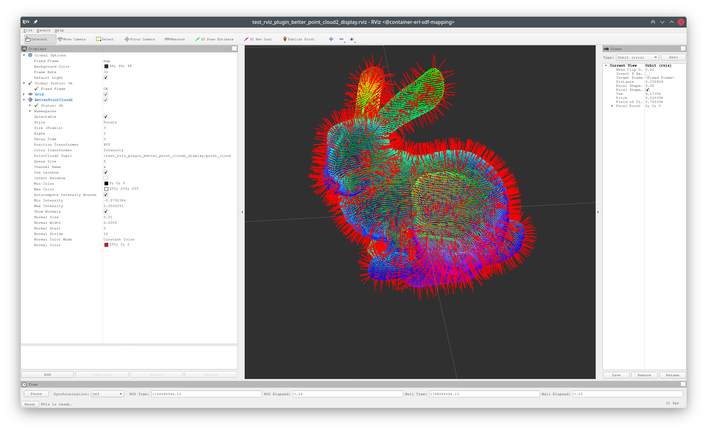
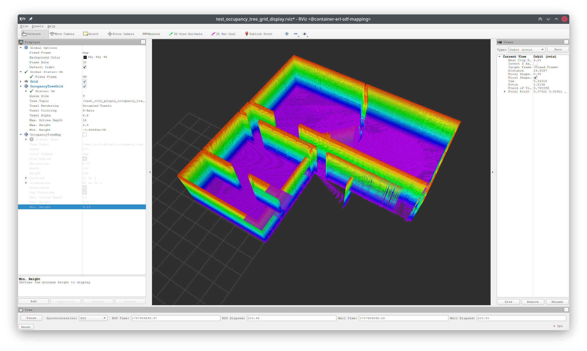
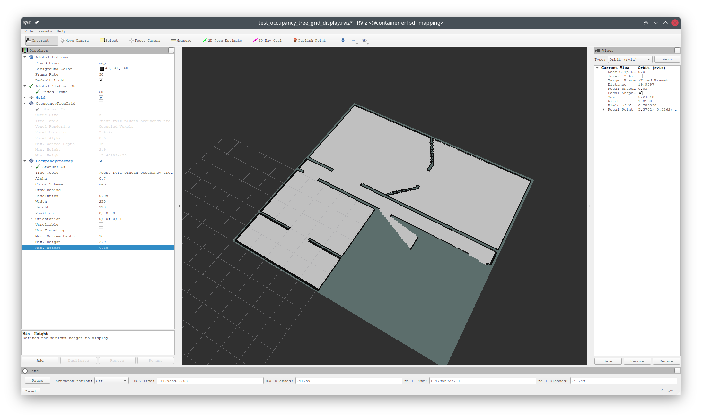

erl_geometry_rviz_plugin
========================

[](https://opensource.org/licenses/MIT)
[](http://wiki.ros.org/)
[](https://docs.ros.org/)

A collection of custom RViz plugins for visualizing geometry data structures and enhanced point cloud displays. This package provides specialized visualization tools for occupancy trees, enhanced point clouds with normal vectors, and other geometric data.

|                                                         |                                                         |                                                        |
| ------------------------------------------------------- | ------------------------------------------------------- | ------------------------------------------------------ |
|  |  |  |

## Features

- **Dual ROS Support**: Compatible with both ROS1 and ROS2
- **Enhanced Point Cloud Visualization**: Display point clouds with normal vectors and improved performance
- **Occupancy Tree Visualization**: Visualize quadtrees and octrees as grids or occupancy maps
- **Custom Geometry Message Support**: Specialized displays for [erl_geometry_msgs](https://github.com/ExistentialRobotics/erl_geometry_msgs)

## Available RViz Displays

### 1. BetterPointCloud2 Display
Enhanced point cloud visualization with support for displaying normal vectors and improved rendering performance.

**Features:**
- Display normal vectors from point cloud data
- Configurable normal vector properties (length, width, color, stride)
- Multiple color modes for normals (constant color, rainbow)
- Improved rendering performance over standard PointCloud2 display

**Message Type:** `sensor_msgs/PointCloud2`

### 2. OccupancyTreeGrid Display
Visualizes occupancy quadtrees (2D) or octrees (3D) as individual grid cells.

**Features:**
- Display occupancy probability as colored grid cells
- Support for both 2D quadtrees and 3D octrees
- Configurable tree depth visualization
- Height filtering for 3D trees

**Message Type:** `erl_geometry_msgs/OccupancyTreeMsg`

### 3. OccupancyTreeMap Display
Converts occupancy trees into standard occupancy grid maps for visualization.

**Features:**
- Convert quadtree/octree to 2D occupancy grid
- Configurable tree depth and height filtering
- Standard occupancy map visualization
- Compatible with navigation stack displays

**Message Type:** `erl_geometry_msgs/OccupancyTreeMsg`

## Installation

### Prerequisites

<details>
<summary><b>ROS1 Dependencies</b></summary>

```bash
# Install ROS1 dependencies
sudo apt install ros-noetic-rviz \
                 ros-noetic-pluginlib \
                 ros-noetic-std-msgs \
                 ros-noetic-nav-msgs \
                 ros-noetic-geometry-msgs \
                 ros-noetic-sensor-msgs \
                 ros-noetic-tf2-ros

# Install OGRE development libraries
sudo apt install libogre-1.9-dev
```
</details>

<details>
<summary><b>ROS2 Dependencies</b></summary>

```bash
# Install ROS2 dependencies
export ROS_DISTRO=humble  # or your desired ROS2 distro
sudo apt install ros-$ROS_DISTRO-rviz2 \
                 ros-$ROS_DISTRO-rviz-common \
                 ros-$ROS_DISTRO-rviz-rendering \
                 ros-$ROS_DISTRO-rviz-default-plugins \
                 ros-$ROS_DISTRO-pluginlib \
                 ros-$ROS_DISTRO-std-msgs \
                 ros-$ROS_DISTRO-nav-msgs \
                 ros-$ROS_DISTRO-geometry-msgs \
                 ros-$ROS_DISTRO-sensor-msgs \
                 ros-$ROS_DISTRO-tf2-ros

# Install development tools
sudo apt install libogre-1.9-dev qtbase5-dev
```
</details>

### Build from Source

<details>
<summary><b>ROS1 Build</b></summary>

```bash
# Create workspace
mkdir -p ~/catkin_ws/src
cd ~/catkin_ws/src

# Clone dependencies
git clone https://github.com/ExistentialRobotics/erl_cmake_tools.git
git clone https://github.com/ExistentialRobotics/erl_common.git
git clone https://github.com/ExistentialRobotics/erl_geometry.git
git clone https://github.com/ExistentialRobotics/erl_geometry_msgs.git
git clone https://github.com/ExistentialRobotics/erl_geometry_rviz_plugin.git

# Build
cd ~/catkin_ws
catkin build --verbose

# Source workspace
source devel/setup.bash
```
</details>

<details>
<summary><b>ROS2 Build</b></summary>

```bash
# Create workspace
mkdir -p ~/ros2_ws/src
cd ~/ros2_ws/src

# Clone dependencies
git clone https://github.com/ExistentialRobotics/erl_cmake_tools.git
git clone https://github.com/ExistentialRobotics/erl_common.git
git clone https://github.com/ExistentialRobotics/erl_geometry.git
git clone https://github.com/ExistentialRobotics/erl_geometry_msgs.git
git clone https://github.com/ExistentialRobotics/erl_geometry_rviz_plugin.git

# Build
cd ~/ros2_ws
colcon build --packages-up-to erl_geometry_rviz_plugin

# Source workspace
source install/setup.bash
```
</details>

## Usage

### Loading Plugins in RViz

First, remember to source your workspace.

<details>
<summary><b>ROS1 - Loading Plugins</b></summary>

1. Launch RViz: `rosrun rviz rviz`
2. Click "Add" in the Displays panel
3. Select "By display type" tab
4. Find plugins under:
   - `erl_geometry_rviz_plugin/OccupancyTreeGrid`
   - `erl_geometry_rviz_plugin/OccupancyTreeMap`
   - `erl_geometry_rviz_plugin/BetterPointCloud2`

</details>

<details>
<summary><b>ROS2 - Loading Plugins</b></summary>

1. Launch RViz2: `ros2 run rviz2 rviz2`
2. Click "Add" in the Displays panel
3. Select "By display type" tab
4. Find plugins under:
   - `erl_geometry/OccupancyTreeGrid`
   - `erl_geometry/OccupancyTreeMap`
   - `BetterPointCloud2`

</details>

### Test Launch Files

The package includes test launch files to demonstrate plugin functionality:

#### BetterPointCloud2 Display Test

<details>
<summary><b>ROS1</b></summary>

```bash
roslaunch erl_geometry_rviz_plugin test_rviz_plugin_better_point_cloud2_display.launch
```
</details>

<details>
<summary><b>ROS2</b></summary>

```bash
ros2 launch erl_geometry_rviz_plugin test_rviz_plugin_better_point_cloud2_display_launch.py
```
</details>

#### OccupancyTree Display Test

<details>
<summary><b>ROS1</b></summary>

```bash
roslaunch erl_geometry_rviz_plugin test_rviz_plugin_occupancy_tree_display.launch
```
</details>

<details>
<summary><b>ROS2</b></summary>

```bash
ros2 launch erl_geometry_rviz_plugin test_rviz_plugin_occupancy_tree_display_launch.py
```
</details>


## Troubleshooting

1. **Plugins not loaded**: Verify workspace is sourced: `source <devel|install>/setup.bash`
1. **Large point clouds**: Increase normal stride to reduce rendering load
2. **Deep trees**: Limit tree depth visualization to improve performance
3. **Memory usage**: Use float precision instead of double when possible

## License

This project is licensed under the MIT License - see the [LICENSE](LICENSE) file for details.

## Related Packages

- [`erl_geometry`](https://github.com/ExistentialRobotics/erl_geometry): Core geometry data structures
- [`erl_geometry_msgs`](https://github.com/ExistentialRobotics/erl_geometry_msgs): ROS messages for geometry data
- [`erl_common`](https://github.com/ExistentialRobotics/erl_common): Common utilities and tools
- [`erl_cmake_tools`](https://github.com/ExistentialRobotics/erl_cmake_tools): CMake tools for ERL projects

## Citation

If you use this work in your research, please cite:

```bibtex
@software{erl_geometry_rviz_plugin,
  author = {Dai, Zhirui},
  title = {erl_geometry_rviz_plugin: Custom RViz Plugins for Geometry Visualization},
  url = {https://github.com/ExistentialRobotics/erl_geometry_rviz_plugin},
  version = {0.1.0},
  year = {2024}
}
```
