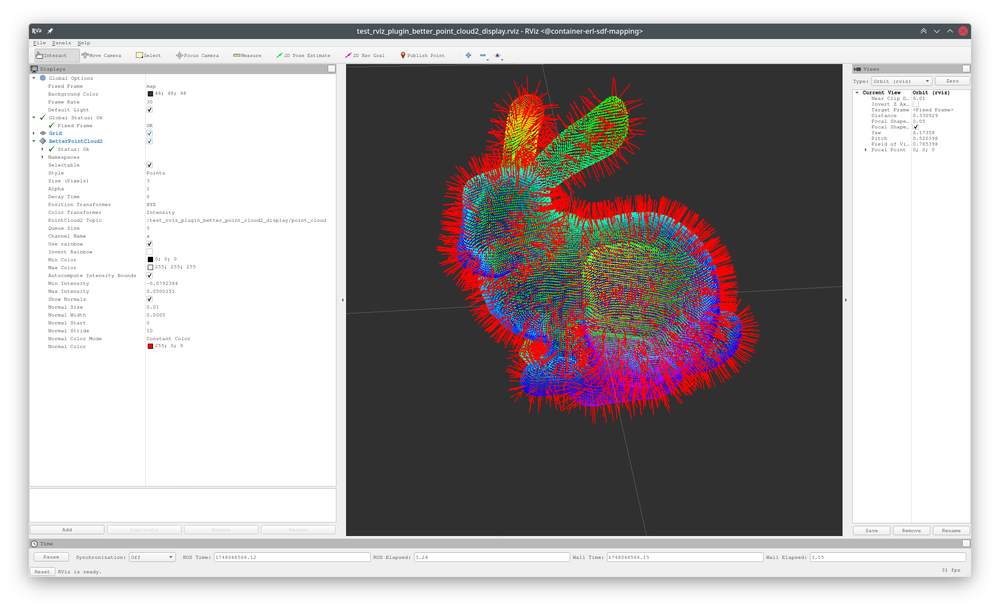

# Launch Files

- [test_rviz_plugin_occupancy_tree_display.launch](test_rviz_plugin_occupancy_tree_display.launch):
  Launches the `test_rviz_plugin_occupancy_tree_display` node to test the rviz plugin for
  visualizing an occupancy quadtree or octree as grids or an occupancy map.
  ```shell
  roslaunch erl_geometry_rviz_plugin test_rviz_plugin_occupancy_tree_display.launch
  # arguments:
  # is_3d: true or false
  # is_double: true or false
  # publish_binary_msg: true or false
  ```
  |                                                  |                                                 |
  | ------------------------------------------------ | ----------------------------------------------- |
  |  |  |

- [test_rviz_plugin_better_point_cloud2_display.launch](test_rviz_plugin_better_point_cloud2_display.launch):
  Launches the `test_rviz_plugin_better_point_cloud2_display` node to test the rviz plugin for
  visualizing a point cloud2 with better performance.
  ```shell
  roslaunch erl_geometry_rviz_plugin test_rviz_plugin_better_point_cloud2_display.launch
  ```
  |                                                              |
  | ------------------------------------------------------------ |
  |  |
